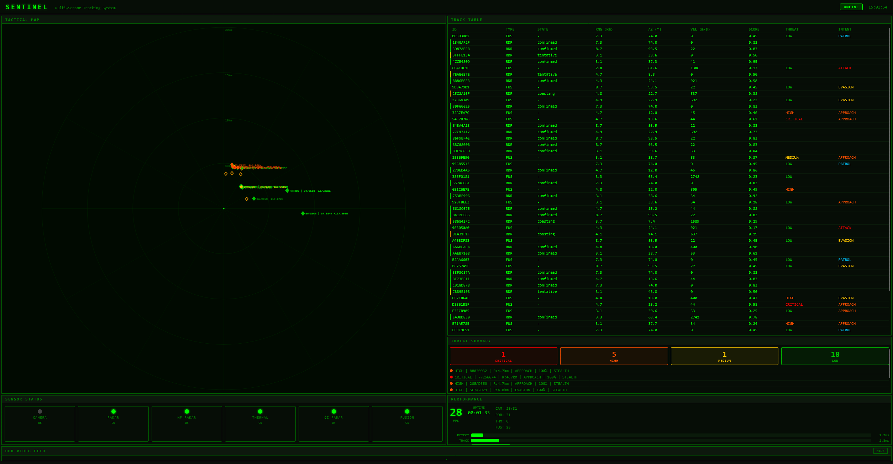

# SENTINEL

**Multi-Sensor Tracking & Fusion Simulation Framework**

SENTINEL is an unclassified, educational multi-sensor tracking and fusion framework. It demonstrates real-time track management, multi-target association, sensor fusion, and visualization using simulated sensor models and publicly available algorithms. No classified data, threat libraries, or real-world military interfaces are used.

> **⚠️ Simulation Only** -- This project is a learning, research, and portfolio demonstration. It is not intended for real-world deployment, and all sensor models, message formats, and decision logic are simplified educational implementations.

## License & Usage

This repository is publicly available **for learning and reference only**.

- You may **view and study** the code for educational purposes.
- You may **NOT copy, reuse, redistribute, or modify** any part of this
  repository without explicit permission.
- **Commercial use is strictly prohibited** without contacting the author
  and receiving written authorization.

If you would like permission to use any part of this project, please
contact me directly.

## Architecture

```
Camera (30 Hz) ──> YOLOv8 ──> TrackManager (Kalman Filter) ──────────────────┐
                                                                               │
Multi-Freq Radar ──> MultiFreqCorrelator ──> RadarTrackManager (EKF) ─────────┤
  (VHF/UHF/L/S/X)     (cross-band grouping)                                   │
                                                                               ├──> MultiSensorFusion
Thermal FLIR ──> ThermalTrackManager (Bearing-Only EKF) ──────────────────────┤    (threat classification)
  (MWIR/LWIR)                                                                  │        │
                                                                               │        ▼
Quantum Radar ──> RadarTrackManager (EKF) ────────────────────────────────────┘   EnhancedFusedTrack
  (QI X-band)       (reuses existing EKF)                                             │
                                                                          ┌───────────┼───────────┐
                                                                          ▼           ▼           ▼
                                                                    IFF Model    Decision     ThreatClassifier
                                                                  (simulated)  Logic (sim)    (ML/rules)
                                                                          │           │           │
                                                                          └───────────┼───────────┘
                                                                                      ▼
                                                                    ┌─────────────────┼─────────────────┐
                                                                    ▼                 ▼                 ▼
                                                               HUD Overlay   History Recorder   DataLink Gateway
                                                              (styled UI)    (ring buffer)    (simulated formats)
                                                                    │                 │                 │
                                                                    ▼                 ▼                 ▼
                                                              Web Dashboard    File Export      Simulated C2
                                                             (FastAPI/WS)     (msgpack/JSON)   (toy protocols)
                                                                    │
                                                                    ▼
                                                           Mesh Network (simulated)
                                                          (composite tracking demo)
```

Four independent sensor paths run at their native rates. Tracks are fused by angular correspondence or statistical (Mahalanobis) distance, with optional temporal alignment to a common epoch. Data association uses either the Hungarian algorithm (hard assignment) or JPDA (soft probabilistic assignment). Fused tracks are enriched with simulated IFF identification, decision-support logic, and threat classification before being distributed via HUD, web dashboard, track history, simulated mesh network, and a simulated data-link gateway.

## Key Capabilities

### Sensing & Detection
- **Object detection**: YOLOv8 on camera frames (USB, RTSP, or video file)
- **Multi-frequency radar**: 5-band simulation (VHF/UHF/L/S/X) with frequency-dependent RCS, plasma sheath attenuation modeling
- **Thermal imaging**: Passive FLIR simulation (MWIR/LWIR) with bearing-only tracking -- no range, unaffected by plasma
- **Quantum illumination radar**: Simplified QI-inspired detection model using entangled microwave photon pairs (TMSV state) for educational exploration of enhanced detection concepts. OPA/SFG/Phase-Conjugate receiver models (not a validated real-world model)
- **Stealth detection scenario**: Cross-band RCS variation flags stealth candidates in simulation (RAM absorbs X-band but not VHF/UHF)
- **Hypersonic detection scenario**: Simulated Mach 5+ targets create extreme thermal signatures (>1500K) that thermal sensors always detect, even when radar is degraded by plasma sheath

### Tracking & Fusion
- **Kalman filter tracking**: Predict-update cycle with automatic track lifecycle (tentative -> confirmed -> coasting -> deleted). Filter types: KF, EKF, CA-KF, IMM
- **Data association**: Hungarian algorithm (globally optimal hard assignment) or JPDA (Joint Probabilistic Data Association -- soft probabilistic assignment with spread-of-innovations covariance)
- **Track quality monitoring**: Normalized Innovation Squared (NIS) metrics with rolling-window filter consistency monitor
- **Temporal alignment**: Predict all tracks to a common reference epoch before fusion using constant-velocity propagation with CWNA process noise
- **Statistical fusion**: Mahalanobis track-to-track distance for cross-sensor correlation
- **Threat classification**: Rule-based or ML classifier with kinematic intent estimation. CRITICAL/HIGH/MEDIUM/LOW threat levels
- **C++ acceleration**: Optional pybind11+Eigen for batch cost matrix computation, geodetic transforms, and association -- transparent fallback to Python

### Simulated Identification & Decision Logic
- **IFF modeling**: Simulated interrogation modes (Mode 3/A, C, S, 4/5) with spoof-detection heuristics (code consistency, kinematic plausibility, encryption validation)
- **Decision-support logic**: Configurable rule engine mapping IFF + threat level to simulated authorization states (weapons_free/weapons_tight/weapons_hold/hold_fire) -- simulation-only tasking demo
- **Engagement zones**: 4 zone types (circular, polygon, annular, sector) with priority-based resolution -- for simulation scenarios only
- **Weapon-target assignment**: Simulated Weapon Engagement Zones (WEZ), Pk/TTI feasibility scoring, Hungarian algorithm optimal assignment across multiple simulated weapon platforms

### Networking & Data Exchange (Simulated)
- **Mesh networking**: Composite tracking demo inspired by CEC concepts, with pub/sub messaging, automatic peer discovery, and multi-node track fusion -- all in simulation
- **Data-link gateway**: Simulated J-series message formats (J2.2, J3.2, J3.5, J7.0) with bit-level binary encoding, bidirectional conversion, and field validation -- toy protocol, not a real-world interface
- **Real-world coordinates**: WGS84 geodetic reference with ENU<->geodetic conversion (GeoContext), C++ accelerated

### Environment & Electronic Warfare (Simulated)
- **Terrain & environment**: 2D elevation grid with ray-marching line-of-sight, ITU-R P.676/P.838 atmospheric propagation (frequency-dependent), weather effects, surface/rain clutter models
- **Electronic warfare**: Simulated noise jamming, deceptive jamming (RGPO), chaff clouds, expendable decoys. ECCM models: sidelobe blanking, frequency agility, burn-through, QI ECCM (entangled photons resist noise jamming)

### Visualization & Recording
- **HUD overlay**: Real-time overlay with track boxes, velocity vectors, targeting reticle, radar/thermal/quantum blips, threat badges, and alert banners (military-style dark theme)
- **Web dashboard**: Real-time browser-based monitoring via FastAPI/WebSocket -- tactical PPI radar scope, sortable track table, threat cards, per-stage latency bars, MJPEG HUD video feed, replay controls. Dark theme, vanilla JS (no build step)
- **Track history & replay**: Ring buffer recording with configurable capture interval, msgpack/JSON export with gzip compression, playback with speed control (0.25x-8x), seek, and web UI

## Portfolio / Technical Highlights

| Aspect | Detail |
|--------|--------|
| **Real-time pipeline** | Camera -> detection -> tracking -> fusion -> HUD at 30 Hz; radar/thermal/QI paths run at independent native rates |
| **Algorithms implemented** | KF, EKF, CA-KF, IMM, Hungarian algorithm, JPDA, Mahalanobis gating, NIS consistency monitoring |
| **Multi-sensor fusion** | 4 independent sensor paths fused by angular correspondence and statistical distance with temporal alignment |
| **ML integration** | scikit-learn threat classifier, kinematic intent estimator, feature extraction pipeline with training harness |
| **C++ acceleration** | Optional pybind11 + Eigen for batch cost matrix computation, geodetic transforms -- transparent Python fallback |
| **Web dashboard** | FastAPI + WebSocket real-time UI with PPI radar scope, sortable track table, latency metrics, MJPEG video feed |
| **Test coverage** | 2,181 tests -- unit (~1,900), integration (~130), scenario validation (~100), plus performance benchmarks |
| **Tech stack** | Python 3.10+, NumPy, SciPy, OpenCV, Ultralytics (YOLOv8), FastAPI, pybind11/Eigen, scikit-learn |
| **Architecture** | Clean separation of concerns: sensors, detection, tracking, fusion, classification, visualization -- all independently configurable |

### Web Dashboard



## Quick Start

### Install

```bash
pip install -e ".[dev]"
```

### Run

```bash
# Default: USB webcam + radar simulator
sentinel

# Custom config
sentinel --config config/default.yaml

# Video file input
sentinel --source path/to/video.mp4

# Override YOLO model and device
sentinel --model yolov8s.pt --device cuda:0

# Enable web dashboard (requires web extras)
pip install -e ".[web]"
sentinel --web
```

### Test

```bash
pytest tests/ -v
```

2181 tests covering all subsystems.

## Configuration

All settings live in `config/default.yaml` under the `sentinel:` namespace. Key sections:

| Section | Description |
|---------|-------------|
| `system` | System name, version, log level, graceful degradation |
| `time` | Clock mode (`realtime`/`simulated`), step size, start epoch |
| `sensors.camera` | Camera source, resolution, FPS |
| `sensors.radar` | Single-frequency radar simulator |
| `sensors.multifreq_radar` | Multi-band radar with per-band noise profiles |
| `sensors.thermal` | Thermal FLIR simulator with MWIR/LWIR bands |
| `sensors.quantum_radar` | Quantum illumination radar (QI X-band, TMSV source) |
| `detection` | YOLOv8 model, confidence, device |
| `tracking` | Kalman filter params, association gating, track lifecycle |
| `tracking.association` | Association method (`hungarian`/`jpda`), JPDA parameters |
| `tracking.track_quality` | NIS monitoring (enabled, window size) |
| `tracking.radar` | EKF params for radar tracking (3D, Doppler options) |
| `tracking.thermal` | Bearing-only EKF params for thermal tracking |
| `tracking.quantum_radar` | EKF params for quantum radar tracking |
| `fusion` | Azimuth gates, temporal alignment, statistical distance, threat classification |
| `environment` | Terrain masking, atmospheric propagation, weather, clutter, EW |
| `iff` | Simulated IFF interrogation modes, spoof detection, range limits |
| `roe` | Decision-support rule engine postures and overrides |
| `geo_reference` | WGS84 reference point (lat/lon/alt) for geodetic output |
| `network` | Mesh networking: node ID, role, transport, pub/sub, composite fusion |
| `engagement` | Simulated engagement zones, weapon profiles, Pk/TTI/threat weights |
| `history` | Track history recording: buffer size, capture interval, storage format, replay |
| `datalink` | Data-link gateway: publish rate, validation, track number pool, inbound handling |
| `ui.hud` | HUD colors, overlay alpha, scanline effect |
| `ui.web` | Web dashboard: host, port, update rate, video FPS |

All features default to OFF except camera, radar, fusion, and HUD. Enable each independently via `enabled: true` in the respective section.

## Project Structure

```
sentinel/
  config/
    default.yaml                # All configuration
  src/sentinel/
    core/
      types.py                  # Detection, TrackState, SensorType, enums
      pipeline.py               # Main orchestrator loop
      config.py                 # Config loader (OmegaConf)
      config_schema.py          # Pydantic validation schema
      clock.py                  # Frame timer, system clock, SimClock
      bus.py                    # Event bus
    sensors/
      base.py                   # AbstractSensor interface
      camera.py                 # OpenCV camera adapter
      radar_sim.py              # Single-freq radar simulator
      multifreq_radar_sim.py    # 5-band radar simulator
      thermal_sim.py            # Thermal FLIR simulator (bearing-only)
      quantum_radar_sim.py      # Quantum illumination radar simulator
      environment.py            # Terrain, atmosphere, weather, clutter models
      ew.py                     # Electronic warfare: jamming, chaff, decoys, ECCM
      physics.py                # RCS profiles, plasma sheath, thermal signatures, QI physics
      frame.py                  # SensorFrame container
    detection/
      yolo.py                   # YOLOv8 detector wrapper
    tracking/
      filters.py                # KalmanFilter, ExtendedKalmanFilter, BearingOnlyEKF
      base_track.py             # TrackBase (shared state machine, M-of-N, scoring, quality)
      track.py                  # Camera Track (KF-based)
      track_manager.py          # Camera track lifecycle manager
      association.py            # Hungarian associator (IoU + Mahalanobis)
      jpda.py                   # JPDA associators (camera, radar, thermal)
      cost_functions.py         # Cost matrix computation + track-to-track Mahalanobis
      track_quality.py          # NIS/NEES metrics, FilterConsistencyMonitor
      radar_track.py            # Radar Track (EKF-based, polar coords)
      radar_association.py      # Radar Hungarian associator
      radar_track_manager.py    # Radar track lifecycle
      thermal_track.py          # Thermal Track (bearing-only EKF)
      thermal_association.py    # Thermal bearing-based associator
      thermal_track_manager.py  # Thermal track lifecycle
      _accel.py                 # C++ acceleration (pybind11+Eigen, optional fallback)
    fusion/
      track_fusion.py           # Camera-radar fusion (angular + statistical)
      temporal_alignment.py     # Predict tracks to common epoch (CV + CWNA)
      multifreq_correlator.py   # Cross-band detection grouping
      multi_sensor_fusion.py    # 4-sensor fusion + threat classification
    classification/
      feature_extraction.py     # Kinematic + sensor feature vectors
      classifier.py             # ML threat classifier (scikit-learn)
      intent.py                 # Kinematic intent estimator
      training.py               # Training pipeline
    iff/
      interrogator.py           # IFF interrogation engine
      codes.py                  # Mode 3/A, Mode C, Mode S, Mode 4/5
      spoof_detection.py        # Spoof detection (code consistency, kinematics, crypto)
      config.py                 # IFF configuration
    roe/
      engine.py                 # Rules of engagement engine
      config.py                 # ROE configuration
    engagement/
      zones.py                  # Engagement zones (circular, polygon, annular, sector)
      weapons.py                # Weapon profiles and WEZ calculator
      feasibility.py            # Pk/TTI feasibility scoring
      assignment.py             # Hungarian weapon-target assignment
      manager.py                # EngagementManager orchestrator
      config.py                 # Engagement configuration
    history/
      frame.py                  # HistoryFrame snapshot dataclass
      buffer.py                 # Thread-safe ring buffer
      storage.py                # File export/import (msgpack/JSON + gzip)
      recorder.py               # Pipeline recording hook
      replay.py                 # Playback controller with speed control
      config.py                 # History configuration
    datalink/
      codec.py                  # BitWriter/BitReader sub-byte field packing
      j_series.py               # J2.2, J3.2, J3.5, J7.0 message dataclasses
      encoding.py               # Binary encode/decode for each message type
      validator.py              # STANAG field range validation
      adapter.py                # SENTINEL <-> Link 16 bidirectional conversion
      gateway.py                # DataLinkGateway pipeline hook
      transport.py              # Transport protocol + InMemoryTransport
      track_mapping.py          # 13-bit track number allocator (LRU)
      config.py                 # Data link configuration
      stats.py                  # Gateway diagnostics
    network/
      bridge.py                 # NetworkBridge pipeline hook
      transport.py              # TransportHub with latency/jitter/loss simulation
      pubsub.py                 # Topic-based pub/sub messaging
      composite_fusion.py       # Multi-node composite track fusion
      config.py                 # Network configuration
    geo/
      context.py                # GeoContext (WGS84 ENU<->geodetic)
    ui/hud/
      renderer.py               # HUD compositor
      elements.py               # Drawing primitives (boxes, blips, alerts)
      styles.py                 # Colors, fonts, visual config
    ui/web/
      state_buffer.py           # Thread-safe pipeline->web state transfer
      mjpeg.py                  # JPEG frame encoder
      server.py                 # FastAPI app (REST, WebSocket, MJPEG)
      bridge.py                 # WebDashboard lifecycle manager
      static/                   # Frontend: HTML, CSS, JS (vanilla, no build step)
  scripts/
    demo_engagement.py          # Engagement zones demo
    demo_history.py             # Track history & replay demo
    demo_datalink.py            # Link 16 data link gateway demo
  tests/
    unit/test_*.py              # ~1900 unit tests
    integration/test_*.py       # ~130 integration tests
    scenarios/test_*.py         # ~100 scenario validation tests
    benchmarks/test_*.py        # Performance benchmarks
```

## Physics Models (Simplified / Educational)

### Frequency-Dependent RCS (Simulation)

Stealth materials (RAM) are optimized for X-band absorption. At lower frequencies, the RCS increases dramatically:

| Band | Stealth RCS offset vs X-band |
|------|------------------------------|
| VHF | +25 dB |
| UHF | +22 dB |
| L-band | +15 dB |
| S-band | +7 dB |
| X-band | 0 dB (baseline) |

A target with -20 dBsm at X-band appears as +5 dBsm at VHF -- easily detectable. The `MultiFreqCorrelator` flags targets with >15 dB RCS variation across bands as stealth candidates.

### Plasma Sheath Model (Hypersonic Simulation)

At Mach 5+, aerodynamic heating ionizes the surrounding air. This plasma sheath attenuates radar returns, with higher frequencies affected more:

```
attenuation_db = base_atten * (1 + freq_factor) * mach_factor^2
```

Where `freq_factor` ranges from 0.3 (VHF) to 2.0 (X-band). VHF penetrates plasma better, but all radar is degraded.

### Thermal Signatures (Simulation Model)

Thermal imaging is **not affected by plasma** -- it's a passive sensor measuring emitted IR radiation. In the simulation, hypersonic leading edges reach 1650-2760C from aerodynamic heating:

```
T_surface = T_ambient * (1 + 0.85 * 0.2 * Mach^2)
```

At Mach 5, surface temperatures exceed 1500K, making thermal detection the primary sensor for hypersonic targets in the simulation.

### Quantum Illumination (Simplified Educational Model)

This project contains a simplified QI-inspired detection toy model for educational exploration (not a validated real-world model). Quantum illumination uses entangled microwave photon pairs (Two-Mode Squeezed Vacuum state) to achieve a theoretical detection advantage over classical radar. The signal photon is transmitted toward the target while the idler is retained at the receiver; joint measurement exploits quantum correlations.

**TMSV source**: Mean signal photons per mode: `N_S = sinh^2(r)`, where r is the squeeze parameter. QI advantage is maximal when N_S << 1 (r ~ 0.1, N_S ~ 0.01).

**Error exponents** (asymptotic detection performance):

```
QI:        beta_QI = M * N_S / N_B
Classical: beta_C  = M * N_S^2 / (4 * N_B)
Advantage: beta_QI / beta_C = 4 / N_S  (6 dB when N_S << 1)
```

Where M = signal-idler mode pairs per pulse, N_B = thermal background photons.

**Receiver models** (fraction of theoretical 6 dB advantage achieved):

| Receiver | Advantage | Status |
|----------|-----------|--------|
| OPA (Optical Parametric Amplifier) | 3 dB | Experimentally demonstrated |
| SFG (Sum-Frequency Generation) | 6 dB | Theoretical, requires ideal conversion |
| Phase Conjugate | 3 dB | Demonstrated in optical domain |
| Optimal (Helstrom bound) | 6 dB | Theoretical limit |

**Where QI excels (in theory)**: Low N_S + high N_B = the stealth detection scenario. In the simplified model used here, a target with -20 dBsm at X-band is nearly invisible to classical X-band radar, but QI's theoretical 6 dB SNR advantage can push it above the detection threshold. Note: this is an idealized educational model, not a validated real-world claim.

### Combined Detection Probability

Multi-sensor detection probability across N independent sensors:

```
P_total = 1 - product(1 - P_i)
```

## Development Phases

| Phase | Description | Tests |
|-------|-------------|-------|
| 1 | Project scaffold, camera pipeline, YOLOv8 detection | -- |
| 2 | Kalman filter tracking, track lifecycle, HUD overlay | -- |
| 3 | Hungarian algorithm for globally optimal data association | -- |
| 4 | Radar sensor fusion with Extended Kalman Filter | -- |
| 5 | Multi-frequency radar + thermal imaging for stealth/hypersonic detection | -- |
| 6 | Quantum illumination radar for enhanced stealth detection | -- |
| 7 | Algorithm optimization: CA-KF, IMM, 3D/Doppler EKF, cascaded association | -- |
| 8 | Production hardening: error handling, validation, logging, CI/CD | -- |
| 9 | Association & fusion integrity: JPDA, temporal alignment, statistical distance, NIS monitoring | -- |
| 10 | Real-time web dashboard: FastAPI, WebSocket, PPI radar scope, threat cards, MJPEG feed | -- |
| 11 | Scenario validation: stealth ingress, hypersonic raid, multi-target swarm, mixed threat | -- |
| 12 | Terrain & environment: terrain masking, atmospheric propagation, weather effects, clutter | -- |
| 13 | Electronic warfare: noise/deceptive jamming, chaff, decoys, ECCM, QI jamming resistance | -- |
| 14 | Deterministic simulated time: SimClock, clock injection, reproducible scenarios | -- |
| 15 | C++ acceleration: pybind11+Eigen batch ops with transparent Python fallback | -- |
| 16 | Real-world coordinates: WGS84 geodetic, GeoContext, C++ geodetic transforms | -- |
| 17 | Scale & batching: batch C++ cost matrix, association integration | -- |
| 18 | Threat classification AI: ML classifier, intent estimator, feature extraction, training pipeline | -- |
| 19 | IFF modeling + decision-support logic: simulated interrogation, spoof detection, rule engine | -- |
| 20 | Mesh networking: composite tracking demo, pub/sub, multi-node fusion | -- |
| 21 | Simulated engagement zones: WEZ, Pk/TTI feasibility scoring, Hungarian weapon-target assignment | -- |
| 22 | Track history & replay: ring buffer recording, file export/import, playback with speed control | -- |
| 23 | Data-link gateway: simulated J-series message formats, bit-level codec, toy C2 interoperability | 2181 |

## Dependencies

- Python >= 3.10
- NumPy, SciPy (linear algebra, optimization)
- OpenCV (camera I/O, HUD rendering)
- Ultralytics (YOLOv8)
- OmegaConf + PyYAML (configuration)
- Pydantic (config validation)
- FastAPI, uvicorn, websockets (web dashboard -- optional `[web]` extras)
- msgpack (track history serialization)
- scikit-learn, joblib (ML threat classification -- optional)
- pybind11 + Eigen (C++ acceleration -- optional, falls back to Python)

## License

See [License](License) for terms. This project is publicly available for learning and reference only.
For usage permissions, contact the author directly.
